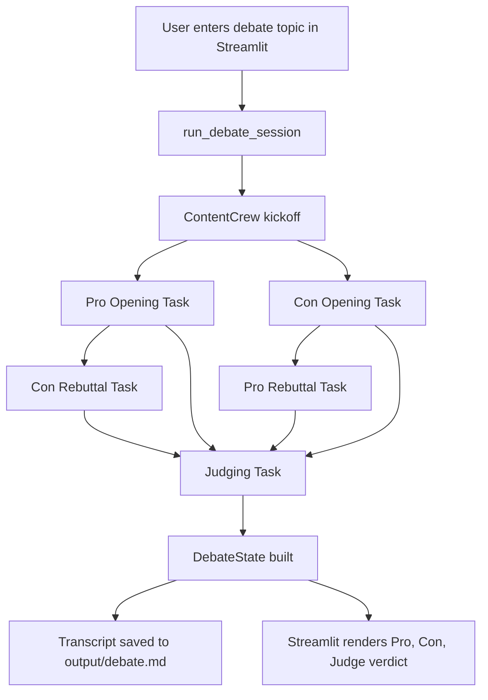

# Debate Arena

Debate Arena is a CrewAI-powered multi-agent debate system with a Streamlit UI.
The user enters a debate topic, two agents argue for and against the motion,
and a judge agent scores the debate and declares a winner.

## Features

- Streamlit app for entering a debate topic and viewing the full debate
- Pro and Con opening statements run in parallel
- Rebuttal round for both sides
- Judge scorecard with winner and short explanation
- Optional web research for debaters through `SerperDevTool`
- Transcript saved to `output/debate.md`

## Architecture



## Project Structure

```text
src/refactored_sniffle/
  main.py                                      # Debate flow and reusable debate runner
  streamlit_app.py                             # Streamlit UI
  crews/content_crew/content_crew.py           # Crew wiring, tools, and per-agent LLM settings
  crews/content_crew/config/agents.yaml        # Agent roles and base config
  crews/content_crew/config/tasks.yaml         # Debate tasks and parallel opening stage
```

## Environment Variables

Create a `.env` file in the project root with the values your setup needs:

```env
OPENAI_API_KEY=...
ANTHROPIC_API_KEY=...
SERPER_API_KEY=...
OPENAI_MODEL=openai/gpt-4o-mini
ANTHROPIC_MODEL=anthropic/claude-sonnet-4
```

Notes:

- `OPENAI_API_KEY` is used by the Pro and Con debaters.
- `ANTHROPIC_API_KEY` is used by the judge.
- `SERPER_API_KEY` enables web research for the debaters.
- `OPENAI_MODEL` and `ANTHROPIC_MODEL` are read in `content_crew.py`.

## Installation

This project uses Python `>=3.10,<3.14` and `uv`.

```bash
uv sync
```

If you changed dependencies and want to refresh the lockfile:

```bash
uv lock
uv sync
```

## Running The Debate Flow

Run the CrewAI flow from the project root:

```bash
uv run crewai run
```

This executes the debate flow and saves the final transcript to `output/debate.md`.

## Running The Streamlit App

Start the UI from the project root:

```bash
uv run streamlit run src/refactored_sniffle/streamlit_app.py
```

The app shows:

- the debate topic
- Pro opening and rebuttal
- Con opening and rebuttal
- judge description
- judge scorecard
- winner

## Execution Flow

1. The user enters a debate topic in Streamlit.
2. `run_debate_session()` in `main.py` starts the crew.
3. `pro_opening_task` and `con_opening_task` run in parallel.
4. Each side generates a rebuttal using the opposing opening as context.
5. The judge reviews all four debate outputs.
6. The app shows the winner, explanation, and scorecard.
7. The transcript is written to `output/debate.md`.

## Key Files

- `src/refactored_sniffle/streamlit_app.py`
  - UI entrypoint
- `src/refactored_sniffle/main.py`
  - reusable debate runner, transcript builder, and CrewAI flow
- `src/refactored_sniffle/crews/content_crew/content_crew.py`
  - CrewAI `Agent`, `Task`, and `Crew` definitions
- `src/refactored_sniffle/crews/content_crew/config/tasks.yaml`
  - task prompts and async opening tasks
- `src/refactored_sniffle/crews/content_crew/config/agents.yaml`
  - role, goal, and backstory for each agent

## Troubleshooting

- If the judge fails to start, confirm `ANTHROPIC_API_KEY` and `ANTHROPIC_MODEL`.
- If web research is not happening, confirm `SERPER_API_KEY`.
- If the Streamlit app opens but the debate fails, check your model API keys and outbound network access.
- If you updated dependencies, run `uv sync`.
